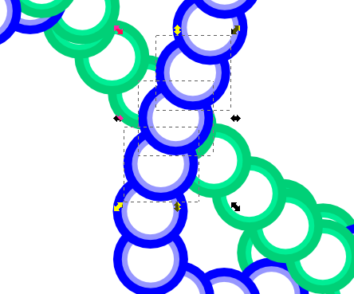
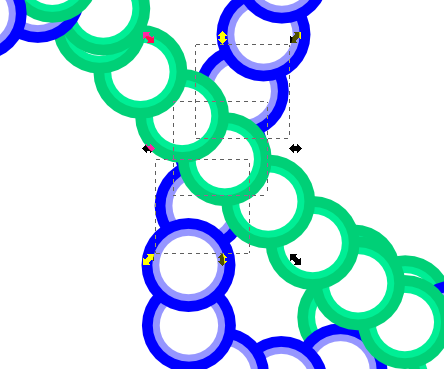
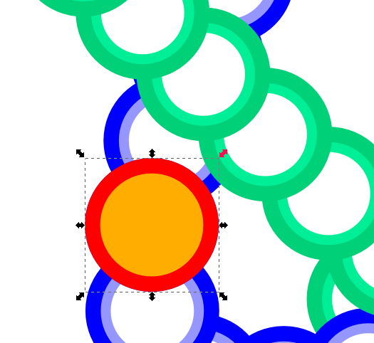
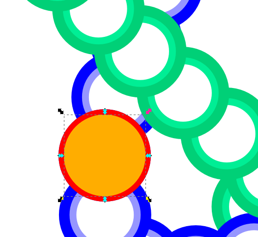
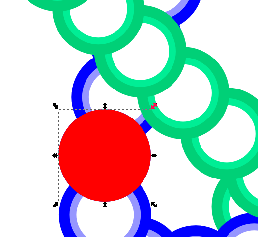
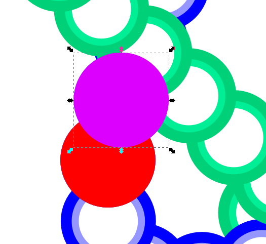
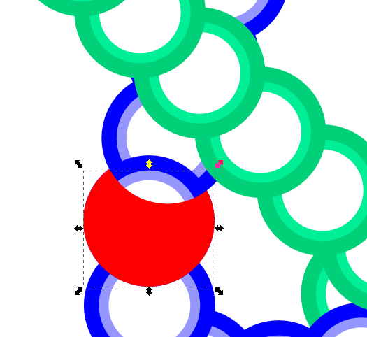
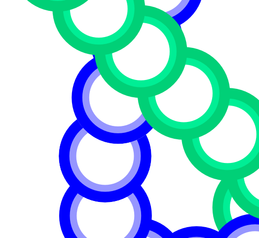

# koishi.py

Script for generating an SVG file with paths that resemble Koishi's "Genetics of the Subconscious" spell card.

## Dependencies

`svgwrite`

## Overview

The script uses two classes, `EllipticTrajectory` and `InterpolatedTrajectory` to output the points that should be on our desired path. The spell card's pattern is modelled as two ellipses that follow a "parent" point, which itself follows an arbitrary trajectory defined by the user.

The "speeds" of each trajectory can be adjusted, as well as how much of the arbitrary trajectory should be followed by the parent point. Changing these parameters is key to getting the final the output you want.

In the future, I might implement having these parameters being read froma YAML file. Right now, they should be editted from within the script (`ELLIPSE_SCALE`, `PARENT_SCALE`, `nodes` in `main`).

## Known issues

The "time" parameter used in the nodes supplied to the `InterpolatedTrajectory` constructor do not behave as documented. This means it is not currently possible to have a trajectory fully stop at a certain point for an arbitrary amount of time.

This will be fixed eventually. I just wanted to upload an older version that has this "bug" but is known to work.

## After running the script

The resulting SVG file can be opened in Inkscape for further editing. You may, for example, choose to use a smaller number of nodes and use Inkscape to transform the straight-line segments into smooth Bezier curves automatically.

I pasted a bullet pattern (actually just a circle) using the `Scatter` extension (Extensions > Generate from Path > Scatter). This is what I used instead of `Pattern along Path` because `Scatter` actually lays down the patterns in an overlapping way, which the other extensions/effects do not. Instead, they place the pattern down as if they were all on the same z-height.

### Manually fixing Z-order

At points where the bullet paths overlap, I chose to manually alter the z-order of clusters of bullets to give the impression than the paths are twisting and coiling (like DNA strands). Unfortunately, just doing this gets rid of the order in which the bullets are overlapped in their individual paths.

In particular, doing this creates a bullet that either covers or is covered by its two neighbors, which shouldn't happen. In other words, we have a pair of bullets in the opposite z-order.

Before changing z-order

After changing z-order. Note the bullet covering both its neighbors, and how it creates an "offending pair".

I fixed this manually by creating a clipping path from the bullets in the offending pair to restore the apparent z-order between those two bullets without actually changing their z-orders.

The idea is to create a clipping path that covers only the part of the bullet that should be visible. To accomplish this, we begin with a circular path corresponding to the bullet that will be clipped (this places the path on the "bottom"). Since the bullets have a stroke width, we need to:

1) Unclone the bullet clone

2) Ungroup the bullet group into its two constituent circular paths

3) Delete the innermost path

4) Select the remaining path and add a fill color (so it has both a fill and a stroke; this should not change its shape)

5) Duplicate the path and, on one of the duplicates (one should be automatically selected), remove the stroke by clicking on the X

6) Select the other path, which should contain a stroke color, and do Path > Stroke to Path

7) Union the two paths into a big circular path

This is necessary because Stroke to Path would not normally retain the size of the original path.

Repeat this for the other bullet in the offending pair, creating a circular path on top of the previous one. Select both paths and perform a boolean subtraction. This should give you a circular path with a concave hole in it. Use this as a clip (Object > Clip > Set).

Below are some additional images illustrating this process:

Both circular paths created

After performing subtraction, we have a clipping path ready

All done -- no more offending pair!
